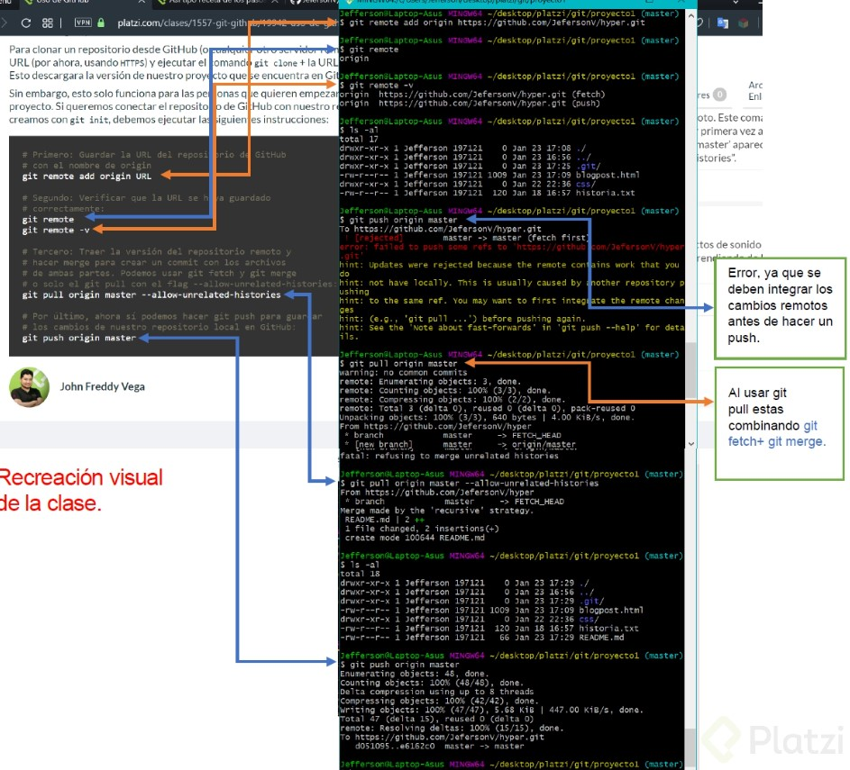

# Curso de Git y Github

## Comandos Basicos de GitHub
- **git init**: crear un repositorio.
- **git add**: agregar un archivo a staging.
- **git commit -m “mensaje”**: guardar el archivo en git con un mensaje.
- **git branch**: crear una nueva rama.
- **git checkout**: moverse entre ramas.
- **git push**: mandar cambios a un servidor remoto.
- **git fetch**: traer actualizaciones del servidor remoto y guardarlas en nuestro repositorio local.
- **git merge**: tiene dos usos. Uno es la fusión de ramas, funcionando como un commit en la rama actual, trayendo la rama indicada. Su otro uso es guardar los cambios de un servidor remoto en nuestro directorio.
- **git pull**: fetch y merge al mismo tiempo.

## Comandos para corrección en GitHub
- **git checkout “codigo de version” “nombre del archivo”**: volver a la última versión de la que se ha hecho commit.
- **git reset**: vuelve al pasado sin posibilidad de volver al futuro, se debe usar con especificaciones.
- **git reset --soft**: vuelve a la versión en el repositorio, pero guarda los cambios en staging. Así, podemos aplicar actualizaciones a un nuevo commit.
git reset --hard**: todo vuelve a su versión anterior
- **git reset HEAD**: saca los cambios de staging, pero no los borra. Es lo opuesto a git add.
- **git rm**: elimina los archivos, pero no su historial. Si queremos recuperar algo, solo hay que regresar. se utiliza así:
- **git rm --cached** elimina los archivos en staging pero los mantiene en el disco duro.
- **git rm --force** elimina los archivos de git y del disco duro.

## Comandos para revisión y comparación en GitHub
- **git status**: estado de archivos en el repositorio.
- **git log**: historia entera del archivo.
- **git log --stat**: cambios específicos en el archivo a partir de un commit.
- **git show**: cambios históricos y específicos hechos en un archivo.
- **git diff “codigo de version 1” “codigo de version 2”**: comparar cambios entre versiones.
- **git diff**: comparar directorio con staging.

## ¿Qué es branch (rama) y cómo funciona un Merge en Git?

Apartir del 1 de Octubre del 2022 hay que renombrar la rama master por la rama main, [enlace.](https://help.dreamhost.com/hc/es/articles/4466702078740-Configurar-git-para-usar-main-como-rama-principal)

1. **Rama main (Master)**

Por defecto, el proyecto se crea en una rama llamada Main (anteriormente conocida como Master). Cada vez que añades código y guardas los cambios, estás haciendo un commit, que es añadir el nuevo código a una rama. Esto genera nuevas versiones de esta rama o branch, hasta llegar a la versión actual de la rama Main.

### ¿Como crear una Branch/Rama en Git?
El comando ***git branch*** permite crear una rama nueva. Si quieres empezar a trabajar en una nueva función, puedes crear una rama nueva a partir de la rama master con git branch new_branch. Una vez creada, puedes usar git checkout new_branch para cambiar a esa rama.

Recuerda que todas tus versiones salen de la rama principal o Master y de allí puedes tomar una versión específica para crear otra rama de versiones.

# Comandos para trabajo remoto con GIT
- **git clone url_del_servidor_remoto:** Nos permite descargar los archivos de la última versión de la rama principal y todo el historial de cambios en la carpeta .git.

- **git push:** Luego de hacer git add y git commit debemos ejecutar este comando para mandar los cambios al servidor remoto.

- **git fetch:** Lo usamos para traer actualizaciones del servidor remoto y guardarlas en nuestro repositorio local (en caso de que hayan, por supuesto).

- **git merge:** También usamos el comando git merge con servidores remotos. Lo necesitamos para combinar los últimos cambios del servidor remoto y nuestro directorio de trabajo.

- **git pull:** Básicamente, git fetch y git merge al mismo tiempo.

## Comandos adicionales para proyectos grandes.

- git log --oneline:Te muestra el id commit y el título del commit.
- git log --decorate: Te muestra donde se encuentra el head point en el log.
- git log --stat: Explica el número de líneas que se cambiaron brevemente.
- git log -p: Explica el número de líneas que se cambiaron y te muestra que se cambió en el contenido.
- git shortlog: Indica que commits ha realizado un usuario, mostrando el usuario y el título de sus commits.
- git log --graph --oneline --decorate y
- git log --pretty=format:"%cn hizo un commit %h el dia %cd": Muestra mensajes personalizados de los commits.
- git log -3: Limitamos el número de commits.
- git log --after=“2018-1-2”
- git log --after=“today” y
- git log --after=“2018-1-2” --before=“today”: Commits para localizar por fechas.
- git log --author=“Name Author”: Commits hechos por autor que cumplan exactamente con el nombre.
- git log --grep=“INVIE”: Busca los commits que cumplan tal cual está escrito entre las comillas.
- git log --grep=“INVIE” –i: Busca los commits que cumplan sin importar mayúsculas o minúsculas.
- git log – index.html: Busca los commits en un archivo en específico.
- git log -S “Por contenido”: Buscar los commits con el contenido dentro del archivo.
- git log > log.txt: guardar los logs en un archivo txt

## **Introducción a las ramas o branches de Git**
-------------------
Las ramas (branches) son la forma de hacer cambios en nuestro proyecto sin afectar el flujo de trabajo de la rama principal. Esto porque queremos trabajar una parte muy específica de la aplicación o simplemente experimentar.

La cabecera o HEAD representan la rama y el commit de esa rama donde estamos trabajando. Por defecto, esta cabecera aparecerá en el último commit de nuestra rama principal. Pero podemos cambiarlo al crear una rama (git branch rama, git checkout -b rama) o movernos en el tiempo a cualquier otro commit de cualquier otra rama con los comandos (git reset id-commit, git checkout rama-o-id-commit).

### ¿Como funcionan las ramas?
Las ramas son la manera de hacer cambios en nuestro proyecto sin afectar el flujo de trabajo de la rama principal. Esto porque queremos trabajar una parte muy específica de la aplicación o simplemente experimentar.

- **git branch -nombre de la rama-**: Con este comando se genera una nueva rama.

- **git checkout -nombre de la rama-**: Con este comando puedes saltar de una rama a otra.

- **git checkout -b rama**: Genera una rama y nos mueve a ella automáticamente, Es decir, es la combinación de git brach y git checkout al mismo tiempo.

- **git reset id-commit**: Nos lleva a cualquier commit no importa la rama, ya que identificamos el id del tag., eliminando el historial de los commit posteriores al tag seleccionado.

- **git checkout rama-o-id-commit**: Nos lleva a cualquier commit sin borrar los commit posteriores al tag seleccionado.

## **¿Como hacer git Merge?**
Para hacer merge, unicamente tenemos que colocarlos cobre la rama con HEAD y colocar el comando git merge nombre_rama.

# **Uso de GitHub**
GitHub es una plataforma que nos permite guardar repositorios de Git que podemos usar como servidores remotos y ejecutar algunos comandos de forma visual e interactiva.

## ¿Como clonar un repositorio?
Para clonar un repositorio desde GitHub (o cualquier otro servidor remoto) debemos copiar la URL (por ahora, usando HTTPS) y ejecutar el comando git clone + la URL que acabamos de copiar. Esto descargará la versión de nuestro proyecto que se encuentra en GitHub.

## ¿Cómo conectar un repositorio de GitHub a nuestro documento local?
Si queremos conectar el repositorio de GitHub con nuestro repositorio local, que creamos usando el comando git init, debemos ejecutar las siguientes instrucciones:
1. Guardar la URL del repositorio de GitHub con el nombre de origin.

        git remote add origin URL

2. Verificar que la URL se haya guardado correctamente:

        git remote
        git remote -v

3. Traer la versión del repositorio remoto y hacer merge para crear un commit con los archivos de ambas partes. Podemos usar git fetch y git merge o solo git pull con el flag --allow-unrelated-histories:

        git pull origin master --allow-unrelated-histories
  
4. Por último, ahora sí podemos hacer git push para guardar los cambios de nuestro repositorio local en GitHub:

        git push origin master

## **Ejemplo de una conexión al repositorio remoto.**

 
